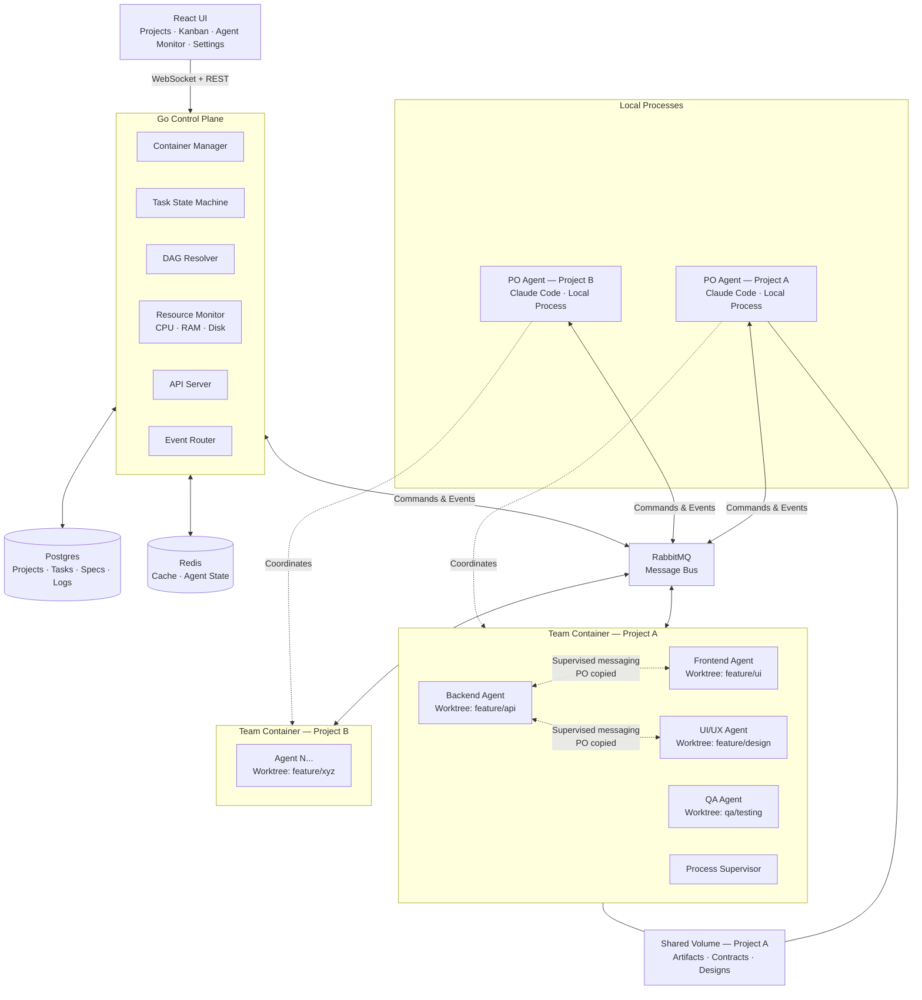

---
tags:
  - type/moc
  - project/foundry
  - domain/tech
created: 2026-03-22
updated: 2026-03-23
status: growing
---

# Foundry — Design Specification

A spec-driven AI development platform that orchestrates teams of AI coding agents to build software from specifications. You work with a Product Owner agent to plan and decompose work, then Foundry spins up a team of specialized agents — backend, frontend, UI/UX, QA, and others — working in parallel inside a shared Docker container using git worktrees for branch isolation. A Go control plane manages the infrastructure while the PO handles the judgment calls.

Specs go in, working software comes out.

## Goals

- Turn a spec into working software with minimal manual intervention
- Orchestrate multiple AI coding agents working in parallel on different parts of a codebase
- Provide visibility into what agents are doing via a real-time kanban board
- Minimize token cost by routing tasks to the cheapest model that can handle them, driven by the same risk classification that determines verification depth
- Produce an auditable execution narrative — the spec mutation log tells the story of every decision, divergence, and adaptation that happened during development
- Replicate the user's development environment and standards in every agent workspace
- Make it easy to add new agent roles by dropping markdown files into a directory
- Support multiple agent CLI providers (Claude Code, Gemini, Codex) through a provider abstraction

## Architecture

### Approach: hybrid orchestration

Go handles the mechanical concerns (container lifecycle, task state machine, dependency resolution, resource monitoring). The Product Owner agent handles the judgment calls (decomposing specs into tasks, deciding team composition, reviewing agent output, maintaining the living spec, re-planning when things go wrong). Go enforces the physical constraints, PO enforces the logical ones.

### System components



### Component responsibilities

| Component | Role |
|-----------|------|
| Go Control Plane | Manages team containers, enforces task state, routes events, serves the API, resolves the task DAG, monitors resource metrics |
| Resource Monitor | Tracks CPU, RAM, and disk usage per container against fuzzy baselines. Kills containers that breach thresholds. Exposes endpoint for PO-initiated shutdown |
| React UI | Project creation, kanban board, agent monitoring, spec/estimate review, verification settings |
| Postgres | Durable state — projects, tasks, specs (approved + execution layers), event logs, agent definitions, risk profiles |
| Redis | Cache — agent state, hot reads, session context |
| RabbitMQ | Message broker — agent coordination, PO commands, agent-to-agent supervised messaging, real-time events |
| Docker | Team isolation — one container per project team, agents share the container |
| Product Owner | Claude Code agent running as a local process; decomposes specs (Opus), assigns tasks, maintains the living spec, reviews output (Sonnet), orchestrates verification |
| Dev Agents | Agent CLI instances (Claude Code for MVP), each on their own git worktree/branch inside the team container |
| QA Agent | Agent CLI instance inside the team container; runs user journey simulation and e2e tests at module boundaries |
| Shared Volume | Artifacts (API contracts, designs, docs) accessible to team container and PO |

## Spec lifecycle

### Two-layer spec model

Most AI coding tools treat the prompt as ephemeral — you type something, the agent does work, the original intent evaporates. Foundry treats the specification as a first-class artifact with its own lifecycle, versioning, and audit trail. This is what makes Foundry's output auditable and its process repeatable.

The spec has two layers that serve different purposes:

**Approved spec** — frozen after the user approves it. This is the contract between the user and the system. It never changes. It records what was agreed to build, the estimated cost, the token budget, the model routing config, and the team composition. This is the reference point for scope, intent, and cost expectations.

**Execution spec** — maintained by the PO during execution. When agent output reveals that assumptions were wrong, interfaces need to change, dependencies don't work as expected, or scope needs to shift, the PO updates the execution spec. Every mutation is logged with a reason and timestamp.

At project completion, the diff between the approved spec and the execution spec tells the story of how the plan evolved and why. This is the audit trail that no other tool in this space produces — not a git log, but a narrative of decisions made under real conditions.

### Why this matters

A spec-driven approach solves three problems that chat-driven and issue-driven tools don't:

1. **Reproducibility.** Given the same approved spec, Foundry should produce roughly the same output. The spec is the seed, not a conversation history.
2. **Accountability.** When something goes wrong, the mutation log shows exactly when the plan diverged and why. No "the AI just did something weird" — every divergence has a recorded reason.
3. **Learning.** Post-project, the approved-vs-execution diff is a dataset. Over time, teams learn which types of specs produce clean executions and which consistently require heavy mutation — feedback that improves future specs.

### Spec mutation protocol

1. PO identifies a divergence between the plan and reality
2. PO logs the reason for the change (what happened, what needs to shift)
3. PO updates the execution spec
4. PO propagates relevant context to affected agents — either via direct task updates or supervised messages
5. Go persists the mutation to the spec history in Postgres

The approved spec is immutable. The execution spec is append-only in terms of its mutation log — each change is a recorded event, not an overwrite.

## Data model

### Entities

**Project**
- `id`, `name`, `description`
- `status`: draft → planning → estimated → approved → active → paused → completed
- `repo_url`: the git repository for this project
- `team_composition`: agent roles selected for this project
- `container_id`: the team container for this project (one container per project)
- `risk_profile_id`: which verification risk profile to use
- `created_at`, `updated_at`

**Spec**
- `id`, `project_id`
- `approved_content`: the frozen PRD/spec document (markdown), immutable after approval
- `execution_content`: the living spec maintained by the PO during execution
- `token_estimate`: estimated token cost for the project
- `agent_count`: estimated number of agents needed
- `approval_status`: pending → approved → rejected
- `approved_at`

**SpecMutation**
- `id`, `spec_id`
- `field_changed`: which part of the execution spec was updated
- `reason`: why the PO made this change
- `diff`: what changed (before/after)
- `created_at`

**Task**
- `id`, `project_id`, `spec_id`
- `title`, `description`
- `status`: pending → assigned → in_progress → paused → review → done
- `risk_level`: low → medium → high (set by PO, can be escalated mid-flight)
- `assigned_role`: which agent role this task is for (e.g., `backend-developer`)
- `assigned_agent_id`: the specific agent working on it
- `depends_on`: array of task IDs this task is blocked by
- `automation_eligible`: boolean, flagged by PO if this task can be handled by the control plane without an agent
- `model_tier`: resolved model tier (haiku, sonnet, opus) based on risk level and project config
- `token_usage`: accumulated token count for this task (updated during execution)
- `context_summary`: written by the agent on pause/completion for resumability
- `created_at`, `updated_at`

**Agent**
- `id`, `project_id`
- `role`: references an agent definition (e.g., `backend-developer`)
- `provider`: which agent CLI provider (e.g., `claude`, `gemini`, `codex`)
- `container_id`: the team container this agent runs in
- `process_id`: the agent's process ID inside the container
- `worktree_path`: the git worktree directory this agent owns
- `branch_name`: the git branch this agent works on
- `status`: starting → active → paused → stopping → stopped
- `current_task_id`
- `health`: healthy → unhealthy → unresponsive
- `created_at`, `updated_at`

**POSession**
- `id`, `project_id`
- `pid`: OS process ID on the host machine
- `status`: starting → active → paused → stopped
- `workspace_path`: path to the project-specific PO directory (e.g., `~/foundry/projects/soapbox/`)
- `started_at`, `stopped_at`

PO sessions are ephemeral — they represent a running PO process. When the PO is stopped and restarted, a new session is created. The PO's persistent knowledge lives in its workspace directory, not in the session record.

**AgentMessage**
- `id`, `project_id`
- `from_agent_id`, `to_agent_id`
- `content`: the message body
- `po_intervention`: nullable, PO's corrective response if it intervened (delivered after the original message)
- `created_at`

**RiskProfile**
- `id`, `project_id` (nullable — null means global default)
- `name`: display name
- `low_criteria`: JSON — what qualifies as low risk (e.g., CRUD, config, boilerplate)
- `medium_criteria`: JSON — what qualifies as medium risk (e.g., new features, integrations)
- `high_criteria`: JSON — what qualifies as high risk (e.g., auth, payments, data migrations)
- `model_routing`: JSON — maps risk levels to model tiers per provider (e.g., `{"claude": {"low": "haiku", "medium": "sonnet", "high": "opus"}, "codex": {"low": "o4-mini", ...}}`). Overridable per project. The control plane reads this when resolving `SessionOpts.Model`.
- `created_at`, `updated_at`

**Event**
- `id`, `project_id`, `task_id` (nullable), `agent_id` (nullable)
- `type`: agent_started, task_assigned, task_completed, agent_paused, artifact_produced, spec_mutated, message_sent, verification_passed, verification_failed, etc.
- `payload`: JSON blob with event-specific data
- `created_at`

**Artifact**
- `id`, `project_id`, `task_id`, `agent_id`
- `type`: api_contract, design_mockup, code_review, documentation, test_report, etc.
- `path`: location on the shared volume
- `description`
- `created_at`

### Relationships

- A Project has one Spec (with approved + execution layers) and many Tasks
- A Project has many POSessions (one active at a time, historical sessions preserved)
- A Spec has many SpecMutations tracking its evolution
- A Project has one team container and one RiskProfile
- A Task has many dependencies (other Tasks) forming the DAG
- An Agent belongs to a Project, owns one worktree/branch, and works on one Task at a time
- Agents can send AgentMessages to other agents (PO always copied, intervention is post-delivery)
- Events reference a Project, and optionally a Task and Agent
- Artifacts are produced by an Agent for a Task

## Agent lifecycle and orchestration

### Project flow

1. **Project creation** — user creates a project in the UI. Go creates the DB record, sets status to `draft`.

2. **Planning phase** — a PO process starts locally. User interacts with the PO via terminal to brainstorm and produce the spec. PO writes the spec to the shared volume. Go persists it to Postgres. Status moves to `planning`.

3. **Estimation** — PO analyzes the spec, determines team composition (pulling from the agent library), classifies tasks by risk level using the project's risk profile, estimates task count and token cost. Writes the estimate to the spec. Status moves to `estimated`.

4. **Approval gate** — user reviews the spec + estimate in the UI. Approve, reject, or request changes. On approval, the spec content is frozen as the approved layer. Status moves to `approved`.

5. **Validation gate** — Go validates PO-generated files (`team.json`, `estimate.json`, `plan.md`) against expected schemas before proceeding. Checks: valid JSON, all referenced roles exist in the agent library, task dependencies form a valid DAG (no cycles), token estimates are positive numbers. If validation fails, the UI shows a specific error (e.g., "plan references 'data-engineer' role not found in agent library") and the user can return to the PO to fix it.

6. **Team spin-up** — Go reads the validated team composition, builds a single Docker container for the project team, clones the repo, creates git worktrees for each agent's branch. PO publishes initial task assignments via RabbitMQ.

7. **Execution loop:**
   - DAG Resolver checks which tasks are unblocked
   - Go assigns unblocked tasks to available agents via RabbitMQ
   - Agents work in their git worktrees, publish progress events
   - PO monitors output, reviews work according to the task's risk level (PO runs Sonnet during execution — pattern-matching, not creative work)
   - PO updates the execution spec when reality diverges from the plan
   - Agents can message each other directly (PO copied on all messages)
   - UI updates the kanban board in real-time
   - User can pause/resume agents or the whole team at any point

8. **Verification loop** (at module/phase boundaries):
   - QA agent spins up inside the team container
   - Runs verification appropriate to the module's risk level
   - Failures route back to dev agents via PO
   - On high-risk modules: PR created, PO directs team to review comments
   - Agents stop at a logical commit point, switch to PR fixes, then resume

9. **Clean pause** — Go sends pause command via RabbitMQ. Agent finishes current subtask, commits work, writes context summary, then the process is stopped. Worktree is preserved for resume.

10. **Completion** — all tasks done, PO does a final review, branches are ready for user review. Status moves to `completed`.

### Task dependency sequencing

The PO understands task dependencies and sequences work like a tech lead:
- BE defines API contracts first
- FE and UI/UX can work in parallel once contracts exist
- FE integrates designs with the API once both are ready

The DAG Resolver in the Go control plane enforces this — a task cannot be assigned until all its dependencies are marked `done`.

### Agent prompt architecture

Each dev agent gets a composite CLAUDE.md assembled from three parts: a base template (how to work in Foundry), a project overlay (project context and coding standards), and a role section (agent identity and expertise). The task itself arrives via the `-p` prompt.

> [!note] Full agent design
> See [[Dev Agent Architecture]] for the complete dev agent design: composite CLAUDE.md content, role definition format, completion protocol, inter-agent messaging format, PO directive schemas, RabbitMQ event types, and the full agent launch sequence.

### Agent communication

Three communication channels, all file-based inside the container with the sidecar bridging to RabbitMQ:

**PO-to-agent (primary).** Task assignments delivered via the launch prompt (`[foundry:task]` block). Review feedback written to `/shared/reviews/<task_id>.md`. Revision directives delivered via a new launch prompt (`[foundry:revision]` block).

**Agent-to-agent (supervised).** Agents message each other by writing JSON files to `/shared/messages/<to_agent_id>/`. The sidecar publishes copies to RabbitMQ so the PO receives them. Messages are delivered immediately — the PO does not block delivery. If the PO disagrees, it writes a follow-up corrective message to the same channel.

**Shared volume (artifacts).** API contracts, design files, documentation written to `/shared/contracts/`, `/shared/designs/`, etc. The sidecar watches for new files and publishes `artifact_produced` events.

### Completion protocol

Agents signal completion by writing to `/shared/status/<agent_id>.json` with status `done`, `blocked`, or `paused`. Each status includes structured metadata (task ID, branch, summary, artifact list). The sidecar watches this directory and publishes the corresponding event to RabbitMQ. Agents self-verify against a risk-based completion checklist before signaling done.

## Verification model

### Risk-based verification

Risk classification is the spine of Foundry's intelligence. The same risk level that determines verification depth also drives model selection (token optimization) and PO attention allocation. A single classification decision cascades through three systems:

- **Verification depth** — how thoroughly work is reviewed
- **Model tier** — which model powers the agent (Haiku, Sonnet, or Opus)
- **PO attention** — how closely the PO monitors progress

This means adding a new risk level or adjusting criteria has compounding effects — tighter classification improves quality, reduces cost, and focuses PO attention simultaneously.

The PO classifies each task's risk level during decomposition. Risk profiles are dynamically weighted with sensible defaults, configurable by the user in UI settings.

### Risk profiles

Risk profiles define what qualifies as low, medium, and high risk. A global default profile ships with Foundry. Users can create project-specific overrides in the UI.

**Default profile:**
- **Low risk** — CRUD operations, boilerplate, configuration, documentation, straightforward utilities
- **Medium risk** — new features, integrations, anything touching shared interfaces, API changes
- **High risk** — authentication, payments, data migrations, core architecture, security-sensitive code

The PO uses the active risk profile as a starting point but can escalate any task mid-flight if it encounters unexpected complexity.

### Verification tiers

**Low-risk verification:**
- Agent runs tests and linter after completing work
- PO skims the diff
- Task moves to done

**Medium-risk verification:**
- Agent self-verifies after each sub-phase (tests pass, linter clean)
- PO reviews each sub-phase before the agent moves on
- At module completion: QA agent spins up inside the team container, runs e2e tests
- Failures route back to dev agents via PO

**High-risk verification:**
- PO reviews every sub-phase
- Comprehensive code coverage enforced
- QA agent runs full user journey simulation + e2e tests at module end
- PR created with review comments
- PO directs the team to review PR feedback
- Agents stop at a logical commit point, switch to address comments, then resume previous work
- PO does final review before marking complete

### QA agent

The QA agent runs inside the same team container as the dev agents. It is created on demand — not during the initial boot sequence, but when the PO determines a module has reached a verification boundary. The process supervisor creates a new worktree, launches the QA agent process, and tears it down when verification is complete. The QA agent's role definition comes from the agent library like any other role.

### Process supervisor

The process supervisor (`supervisor.sh`) manages all agent processes inside the team container. Its responsibilities:
- Launch and register new agent processes (including on-demand QA agents)
- Monitor process health (alive, responsive)
- Handle clean pause: relay pause signals, wait for the agent to commit and write context summary, then stop the process
- On unexpected crash: log the failure, notify the sidecar (which relays to Go and PO), do not auto-restart. The PO decides whether to restart the agent or reassign the task.

### Container recovery

If Go kills a container due to resource threshold breach, the recovery flow is:
1. Go kills the container and logs the event
2. Go notifies the PO via RabbitMQ
3. PO assesses the situation (which agents were running, what work was in progress, what caused the spike)
4. PO calls the Go API to request a new container with adjusted parameters (fewer agents, different team composition) or pauses the project
5. Go spins up the new container, PO re-assigns work based on context summaries agents wrote before the crash

## Container architecture

### One container per team

A single Docker container holds all dev agents for a project. Agents run as separate processes inside the container, managed by a process supervisor. Git worktrees provide branch isolation — each agent gets its own working directory and branch without duplicating the repository or dependencies.

This replaces the original per-agent container model. Benefits:
- No clone overhead per agent — worktrees are instant
- Shared dependencies — `go mod download` or `npm install` runs once, all agents benefit
- Simpler networking — one container on the Docker network instead of N
- Lower resource footprint — one OS layer, shared toolchains

### PO runs locally

The Product Owner is not containerized. It runs as a local Claude Code process on the host machine. Multiple POs can run simultaneously for different projects.

> [!note] Full PO prompt design
> See [[PO Prompt Architecture]] for the complete prompt design: base CLAUDE.md content, session context block format, all six playbooks (planning, estimation, review, execution-chat, escalation, phase-transition), concurrent session handling, and Go invocation patterns.

#### Design principles

The PO is **stateless between sessions**. All knowledge lives in workspace files, not conversation history. Each session boots, reads the project state from disk, does its work, writes results, and exits. This keeps context lean, prevents bloat, and allows planning to span multiple sessions over days or weeks.

The prompt composes in three layers:

1. **Base CLAUDE.md** — identity and workspace conventions. Loaded automatically, never changes.
2. **Session context block** — injected by the control plane via `--append-system-prompt`. Structured metadata: session type, project name, playbook path, tech stack, trigger type, and task context for system-triggered sessions.
3. **Playbook + project files** — the PO reads on its own. The playbook tells it how to behave, the project files tell it where things stand.

Go is infrastructure, PO is intelligence. The control plane passes metadata, the PO reads its own files and makes its own decisions.

#### Session types

| UI action | Session type | Playbook |
|-----------|-------------|----------|
| User clicks "Start Planning" | `planning` | `playbooks/planning.md` |
| Spec approved | `estimation` | `playbooks/estimation.md` |
| User opens chat during execution | `execution-chat` | `playbooks/execution-chat.md` |
| Agent completes a task | `review` | `playbooks/review.md` |
| Agent reports a blocker | `escalation` | `playbooks/escalation.md` |
| All tasks in a phase complete | `phase-transition` | `playbooks/phase-transition.md` |

#### Workspace structure

```
~/foundry/
├── CLAUDE.md                  ← base PO instructions (identity + conventions)
├── playbooks/                 ← session-type-specific instructions
│   ├── planning.md
│   ├── estimation.md
│   ├── review.md
│   ├── execution-chat.md
│   ├── escalation.md
│   └── phase-transition.md
├── principles/                ← generic design and coding philosophy
├── languages/                 ← language-specific conventions (go.md, node.md, etc.)
├── frameworks/                ← framework-specific patterns (react.md, etc.)
├── projects/
│   ├── soapbox/               ← per-project workspace
│   │   ├── project.yaml       ← metadata: name, repo, tech stack
│   │   ├── spec.md            ← evolving during planning
│   │   ├── approved_spec.md   ← frozen on approval
│   │   ├── plan.md            ← phased execution plan (statuses are the state machine)
│   │   ├── execution_spec.md  ← living spec during execution
│   │   ├── mutations.jsonl    ← append-only spec mutation log
│   │   ├── team.json          ← team composition
│   │   ├── estimate.json      ← token budget and cost estimate
│   │   ├── memory/            ← PO's persistent notes and lessons
│   │   ├── decisions/         ← architecture decision records
│   │   └── artifacts/         ← contracts, designs, review notes
│   ├── foundry/
│   └── client-project/
```

The execution plan (`plan.md`) is the state machine. Phase and task statuses (`pending`, `in progress`, `complete`) tell the PO exactly where things stand. No separate status file, no sync issues.

Multiple PO sessions can run concurrently against the same workspace — a user chat session and a system review session are independent processes reading and writing the same files. Different session types typically touch different files, so conflicts are rare.

Shared volume access: the shared volume for each project is bind-mounted to a host path (e.g., `~/foundry/projects/<name>/shared/`) so the PO can read and write artifacts directly from its local process. The same host path is mounted into the team container at `/shared`. Both the PO and the team container see the same files.

### Team container image

A single Foundry team image that all project containers use:
- Ubuntu base with Git, Node.js, and common dev tools
- Agent CLI (Claude Code for MVP) pre-installed at a user-configurable version (default: pinned to a known-good version, user can opt into "latest" via UI settings)
- Process supervisor for managing multiple agent processes
- Entrypoint script that clones the repo and sets up the base workspace environment
- RabbitMQ sidecar for receiving commands, publishing events, and relaying agent-to-agent messages
- Mounts for shared volume, agent library, and SSH keys

### Container internal structure

```
/ (container root)
├── /workspace/                        ← primary git checkout (main branch)
│   ├── .git/
│   └── ...                            ← the project source code
│
├── /worktrees/                        ← git worktrees, one per agent
│   ├── backend-agent/                 ← worktree on feature/api branch
│   │   ├── CLAUDE.md                  ← composite: base + project overlay + role
│   │   ├── .claude/
│   │   │   ├── languages/             ← selected based on agent role
│   │   │   ├── frameworks/            ← selected based on agent role
│   │   │   └── agent-role.md          ← copied from agent library
│   │   └── ...                        ← project source (via worktree)
│   ├── frontend-agent/                ← worktree on feature/ui branch
│   ├── uiux-agent/                    ← worktree on feature/design branch
│   └── qa-agent/                      ← worktree on qa/testing branch (created on demand)
│
├── /shared/                           ← shared volume (team + PO read/write)
│   ├── spec.md                        ← execution spec (living document)
│   ├── contracts/                     ← API contracts, OpenAPI specs
│   ├── designs/                       ← UI/UX design artifacts
│   ├── context/                       ← agent context summaries (written on pause)
│   ├── reviews/                       ← PO code review notes
│   ├── messages/                      ← inter-agent messages (per-agent subdirectories)
│   └── status/                        ← agent completion signals (per-agent JSON files)
│
├── /agents/                           ← read-only mount of agent library
│   ├── backend-developer.md
│   ├── frontend-developer.md
│   ├── qa-tester.md
│   └── ...                            ← 40+ role definitions
│
├── /foundry/                          ← team runtime
│   ├── entrypoint.sh                  ← bootstrap script
│   ├── supervisor.sh                  ← process supervisor for agent processes
│   ├── sidecar.js                     ← HTTP notification server + RabbitMQ client (commands, events, agent messages)
│   ├── heartbeat.sh                   ← writes timestamp every 10s
│   └── state/                         ← runtime state files
│       ├── heartbeat                  ← last heartbeat timestamp
│       ├── agents.json                ← all active agent processes and their worktrees
│       └── pause-signal               ← created by sidecar when pause requested
│
├── /root/.ssh/                        ← read-only mount of host SSH keys
└── /usr/local/                        ← pre-installed tools (baked into image)
    ├── bin/claude                     ← Claude Code CLI (MVP provider)
    ├── go/                            ← Go toolchain
    └── bin/node                       ← Node.js runtime
```

### Volume mapping

```
# Primary workspace (repo checkout, shared across worktrees via git)
foundry-team-<project-id>:/workspace

# Shared between team container and PO (bind-mount to host path)
~/foundry/projects/<name>/shared:/shared

# Read-only from host (paths configured in Foundry settings)
$FOUNDRY_AGENT_LIBRARY:/agents:ro
$FOUNDRY_SSH_KEY_PATH:/root/.ssh:ro
```

### Boot sequence

1. Container starts, `entrypoint.sh` runs
2. Clone repo into `/workspace`
3. Copy base workspace environment (CLAUDE.md template, `.claude/`) into `/workspace`
4. Start `sidecar.js` (RabbitMQ client) in background
5. Start `heartbeat.sh` in background
6. Read team composition from `/shared/team.json`
7. For each agent role in the team:
   a. Create git worktree at `/worktrees/<role>/` on the agent's branch
   b. Copy role-specific workspace (language/framework files, agent-role.md) into the worktree
   c. Generate composite CLAUDE.md (base + project overlay + role)
   d. Launch agent CLI process in the worktree directory
   e. Register process with supervisor
8. Supervisor monitors all agent processes, reports status via sidecar to RabbitMQ

### Resource monitoring

The Go control plane monitors container-level metrics:
- **CPU usage** against a fuzzy baseline (configurable per project)
- **RAM usage** against a fuzzy baseline
- **Disk usage** against available volume space

If a container breaches its resource thresholds, Go kills it and notifies the PO. The PO decides how to recover — restart the container, reduce the team size, or pause the project.

The Go control plane also exposes a shutdown endpoint that the PO can call to request a container kill if the PO detects something wrong at the logical level (agents stuck in a loop, producing nonsensical output, etc.).

### Networking

The team container sits on a Docker network with access to RabbitMQ. Agent-to-agent messaging inside the container goes through the sidecar (which routes via RabbitMQ so the PO gets copies). The shared volume provides artifact exchange.

### Git credentials

Agents need to clone and push to repositories. SSH keys or a `GIT_TOKEN` environment variable are injected at container creation. The specific credential method is configured in Foundry settings.

### Log streaming

Agent logs are streamed via a dedicated RabbitMQ topic exchange. The sidecar captures stdout from each agent process and publishes to `logs.<project_id>.<agent_id>` routing keys. The Go Event Router subscribes and forwards to the React UI over WebSocket. Logs are persisted to Postgres for post-mortem review.

## Token optimization

Foundry's spec-driven decomposition creates a natural opportunity: not every task needs the most expensive model. A CRUD endpoint doesn't need the same reasoning power as a payment integration. The risk classification system already makes this judgment call during planning — token optimization just extends it to model selection.

### Cost-aware model routing

Task risk level maps directly to model tier:

| Risk level | Model tier | Use case | Relative cost |
|------------|-----------|----------|---------------|
| Low | Haiku-class | CRUD, boilerplate, config, docs, formatting | 1x (baseline) |
| Medium | Sonnet-class | New features, integrations, shared interfaces | 12x |
| High | Opus-class | Auth, payments, migrations, core architecture | 60x |

The PO assigns risk levels during spec decomposition. The Go control plane maps risk to model tier when launching agent sessions. This is a configuration decision, not a code change — the `SessionOpts.Model` field is set based on the task's `risk_level` before the agent starts.

Default mapping is overridable per project in the risk profile settings. A team that wants Opus for everything can set all tiers to Opus. A cost-conscious team can push medium-risk work down to Haiku.

For a typical project where 60-70% of tasks are low-risk, 20-30% medium, and 5-10% high, the weighted cost reduction is roughly 50-70% compared to running Opus for everything.

### Mid-task model escalation

The PO can escalate a task's risk level mid-flight, which triggers a model upgrade. If an agent on Haiku hits unexpected complexity (failing tests, architectural decisions it can't resolve), the PO:

1. Pauses the agent
2. Escalates the task risk level (low → medium, medium → high)
3. Go restarts the agent session with the higher-tier model
4. The agent resumes from its context summary

This is the same pause/resume flow Foundry already supports — escalation just adds a model change to the restart. The agent's worktree and branch are preserved; only the model backing its session changes.

### Response caching

Agents working on similar tasks across projects often produce near-identical prompts — test scaffolds, config files, CRUD boilerplate. Redis caches LLM responses keyed by a content hash of the prompt, model, and temperature. On cache hit, the response is returned without an API call.

Cache is scoped per project to prevent cross-contamination. TTL is short (5-10 minutes) to avoid stale responses. Cache is best-effort — misses just fall through to the API. The control plane tracks cache hit rates per project as an event metric for visibility.

### Local execution for deterministic tasks

Some tasks don't need an LLM at all. File scaffolding from templates, linting fixes, formatting, and dependency installation are deterministic operations the Go control plane can handle directly. During spec decomposition, the PO can flag tasks as `automation_eligible`. The control plane executes these via shell commands in the team container, skipping the agent entirely.

This is intentionally conservative at MVP — only tasks the PO explicitly flags are eligible. No heuristic classification. The PO is the judgment layer; the control plane just follows instructions.

### Token budget tracking

The spec includes a token estimate at approval time. During execution, the control plane tracks actual token consumption per task and per agent (reported via provider-specific mechanisms — Claude Code exposes usage in its output). The PO receives a budget utilization event when the project crosses 50%, 75%, and 90% of the estimate, allowing it to adjust strategy — escalating fewer tasks to Opus, batching related low-risk work, or flagging to the user that the estimate was off.

Token usage is logged as events in Postgres and surfaced in the UI on the project dashboard.

## Agent CLI provider abstraction

### Design

Foundry supports multiple agent CLI tools through a provider interface, following the same pattern used in Clipsmith's provider abstraction. The interface defines what any agent CLI must do. Concrete implementations handle the specifics of each CLI tool. A factory with string-based routing handles construction and availability checks.

> [!note] Implementation reference
> See [[Agent CLI Provider Reference]] for the full technical details: exact CLI flags, NDJSON event schemas, token usage extraction, authentication, rate limits, known bugs, and Go integration patterns for all three providers.

### Interface

```go
// AgentProvider defines the contract for an agent CLI backend.
type AgentProvider interface {
    // Name returns the provider identifier (e.g., "claude", "gemini", "codex").
    Name() string

    // Available checks if the CLI is installed and credentials are configured.
    Available() bool

    // Start launches an agent session in the given working directory.
    Start(ctx context.Context, opts SessionOpts) (Session, error)

    // ModelFor resolves an abstract tier ("haiku", "sonnet", "opus") to this
    // provider's concrete model name. Returns the provider-specific model string
    // that gets passed as a CLI flag.
    ModelFor(tier string) string

    // TokenUsage extracts token consumption from the session's output.
    // Each provider reports usage differently — Claude Code includes it in
    // JSON output, Codex reports it in event streams, etc.
    TokenUsage(output string) (input int, output int, err error)
}

// Session represents a running agent CLI session.
type Session interface {
    // Send delivers a prompt or instruction to the running agent.
    Send(ctx context.Context, prompt string) error

    // Output returns a channel streaming the agent's stdout.
    Output() <-chan string

    // Stop gracefully terminates the session.
    Stop(ctx context.Context) error

    // Healthy reports whether the session is still responsive.
    Healthy() bool
}

// SessionOpts configures a new agent session.
type SessionOpts struct {
    WorkDir     string            // Working directory (worktree path)
    Role        string            // Agent role definition to load
    Environment map[string]string // Environment variables
    Model       string            // Resolved model tier — set by control plane based on task risk level, not hardcoded per role
    TaskID      string            // Task being worked on (for token tracking)
}
```

### Model tier resolution

The control plane resolves the model for each agent session through a chain:

1. **Risk classification** — PO assigns `risk_level` to each task during decomposition
2. **Tier mapping** — `risk_profile.model_routing` maps risk level to abstract tier, per provider
3. **Floor check** — agent role's `min_model` prevents downgrading below a threshold
4. **Provider translation** — `provider.ModelFor(tier)` converts the abstract tier to a concrete model name

The `model_routing` field on `RiskProfile` stores the full mapping:

```json
{
  "claude": { "low": "haiku", "medium": "sonnet", "high": "opus" },
  "gemini": { "low": "gemini-2.5-flash", "medium": "gemini-2.5-pro", "high": "gemini-2.5-pro" },
  "codex":  { "low": "o4-mini", "medium": "gpt-5.4", "high": "gpt-5.4" }
}
```

Each provider's `ModelFor()` translates the tier string to its CLI-specific model name. This mapping is also configurable — when new models ship, users update the routing config without code changes.

### How each CLI is invoked

Every supported CLI has a headless mode with per-session model selection:

| Provider | Headless command | Model flag | Structured output |
|----------|-----------------|------------|-------------------|
| Claude Code | `claude -p "prompt"` | `--model haiku` | `--output-format stream-json` |
| Gemini CLI | `gemini "prompt"` | `-m gemini-2.5-flash` | `--output-format json` |
| Codex CLI | `codex exec "prompt"` | `-m o4-mini` | `--json` |


The provider implementation wraps this. For example, the Claude provider:

```go
func (p *ClaudeProvider) Start(ctx context.Context, opts SessionOpts) (Session, error) {
    model := p.ModelFor(opts.Model) // "haiku" → "haiku" (Claude uses tier names directly)
    args := []string{
        "-p", prompt,
        "--model", model,
        "--output-format", "stream-json",
        "--dangerously-skip-permissions", // agents run in sandboxed containers
    }
    // Launch process in opts.WorkDir...
}

func (p *ClaudeProvider) ModelFor(tier string) string {
    // Claude Code accepts tier aliases directly
    return tier // "haiku", "sonnet", "opus"
}
```

A Codex provider would translate differently:

```go
func (p *CodexProvider) ModelFor(tier string) string {
    switch tier {
    case "haiku":
        return "o4-mini"
    case "sonnet", "opus":
        return "gpt-5.4" // Codex has fewer model tiers
    default:
        return "gpt-5.4"
    }
}
```

The `TokenUsage()` method handles the other direction — extracting consumption data from each CLI's output format so the control plane can track budget. Claude Code includes usage in its JSON stream. Codex emits usage events. Each provider parses its own format.

### Project structure

```
internal/agent/
├── provider.go              ← interface definitions (AgentProvider, Session, SessionOpts)
├── registry.go              ← factory + string-based routing
├── tier.go                  ← model tier resolution logic (risk → tier → provider model)
├── providers/
│   └── claude/              ← Claude Code CLI implementation (MVP)
│       ├── provider.go      ← implements AgentProvider (including ModelFor, TokenUsage)
│       └── session.go       ← implements Session
```

### MVP scope

Only the Claude Code provider is implemented for MVP. The provider interface exists so the abstraction is in place, but Gemini and Codex providers are post-MVP. See [[Agent CLI Provider Reference]] for the full multi-provider research (exact flags, event schemas, auth, known bugs for all three CLIs) — this is preserved for when we add providers later.

Claude Code is the strongest choice for MVP: it's the only CLI with built-in budget caps (`--max-budget-usd`), direct cost reporting in USD, the `--bare` flag for deterministic container startup, and granular tool allowlisting. Gemini has known hang bugs in headless mode and no budget caps. Codex has no budget caps and weaker sandboxing on Linux.

### Configuration

The agent library format includes provider and model fields:

```yaml
---
name: backend-developer
description: "Use for backend implementation tasks"
provider: claude
tools: Read, Write, Edit, Bash, Glob, Grep
model: sonnet
---
```

For MVP, `provider` defaults to `claude` if omitted. Post-MVP, different roles can use different providers within the same team.

## Agent library

Agent definitions are markdown files with YAML frontmatter stored in a directory. Adding a new agent type requires no code changes — just drop a new `.md` file.

### Format

```yaml
---
name: backend-developer
description: "Use for backend implementation tasks"
provider: claude
tools: Read, Write, Edit, Bash, Glob, Grep
model: sonnet          # default model — overridden at runtime by task risk level
min_model: haiku       # floor — never route below this tier for this role
---

[Role definition, workflow, checklists, communication protocol...]
```

The PO scans the library when composing a team, matching role requirements to available agent definitions. The `tools` field informs what capabilities each agent needs. The `model` field is a default — at runtime, the control plane resolves the actual model tier based on the task's risk level and the project's model routing config. The `min_model` field sets a floor (some roles, like security-reviewer, should never run on Haiku regardless of task risk). The `provider` field selects the agent CLI backend.

### Initial library

The agent library directory is configurable via Foundry settings. The default ships with 40+ agent definitions covering backend, frontend, UI/UX, QA, DevOps, data engineering, and more. The library path is mounted read-only into the team container at `/agents`.

## UI

### MVP views

**Project List (Home)** — all projects with status, active agent count, task progress, and primary action (Approve, View). New project creation button.

**Project Dashboard** — two sections:
- Agent status bar: each running agent with current task, health indicator, and pause control
- Kanban board: tasks flow through Backlog → In Progress → Review → Done. Cards show assigned agent, risk level, blocked-by dependencies, and branch names. Real-time updates via WebSocket.

**Agent Detail** — click an agent to see:
- Left panel: current task, worktree path, branch, commit count, artifacts produced
- Right panel: live log stream from the agent's CLI session

**Spec View** — side-by-side view of approved spec and execution spec. Mutation log showing what changed, when, and why. The spec view is Foundry's unique artifact — no other tool produces this kind of execution narrative.

**Token Dashboard** — project-level cost visibility:
- Budget utilization bar (estimated vs. actual tokens consumed)
- Per-task token breakdown with model tier used
- Cost savings indicator (actual cost vs. what it would have cost on Opus-only)
- Model tier distribution chart (what percentage of tasks ran on each tier)

**Settings** — project-level settings:
- Risk profile configuration: adjust what qualifies as low/medium/high risk
- Model routing: configure which model tier each risk level maps to
- Resource thresholds: CPU, RAM, disk baselines for container monitoring

### MVP interactions

- Create a project
- View and approve specs with cost estimates
- Start a project (triggers team container spin-up)
- Pause/resume individual agents
- Pause/resume the entire team
- View the kanban board updating in real-time
- Drill into an agent to see live logs
- View the spec document (approved + execution layers)
- View spec mutation history
- Configure risk profiles for verification

Planning phase interaction happens via terminal — the user starts the PO process locally and drives the conversation directly. The Go control plane manages the container lifecycle; the user drives the planning.

## Tech stack

| Component | Technology |
|-----------|-----------|
| Backend | Go |
| Frontend | React |
| Database | Postgres |
| Cache | Redis |
| Message Broker | RabbitMQ |
| Container Runtime | Docker (Docker SDK for Go) |
| Real-time | WebSocket (Go → React) |
| Agent Runtime | Agent CLI providers in Docker container (Claude Code for MVP) |
| Branch Isolation | Git worktrees |

## Project structure

When implementation begins, the project will live at `~/Documents/claude_workspace/foundry` following the same workspace conventions as other projects (Soapbox, DiffGuard, Clipsmith).

```
foundry/
├── CLAUDE.md                       # Project-specific conventions, module gates, commands
├── .claude/
│   ├── languages/                  # Go, Node/TypeScript conventions
│   ├── frameworks/                 # React conventions
│   ├── agents/                     # Project-relevant agent subset
│   ├── skills/                     # Project-specific skills (e.g., review-pr)
│   └── lessons_learned.md          # Living document of mistakes and discoveries
├── cmd/foundry/                    # Entry point, composition root
├── internal/
│   ├── config/                     # Configuration loading
│   ├── database/                   # Postgres connection, migrations
│   ├── cache/                      # Redis client
│   ├── broker/                     # RabbitMQ client, exchanges, message routing
│   ├── container/                  # Docker container management, resource monitor
│   ├── orchestrator/               # DAG resolver, task state machine, project starter
│   ├── agent/                      # Agent provider interface, registry, Claude provider
│   │   ├── provider.go             # Interface definitions
│   │   ├── registry.go             # Factory + routing
│   │   └── providers/
│   │       └── claude/             # Claude Code CLI implementation
│   ├── spec/                       # Spec CRUD, mutation tracking, two-layer model
│   ├── project/                    # Project CRUD, risk profiles
│   ├── verification/               # Verification orchestration, risk classification
│   ├── event/                      # Event logging, routing
│   ├── api/                        # HTTP handlers, WebSocket, middleware
│   └── shared/                     # Shared types, errors, helpers
├── web/                            # React frontend (Vite + TypeScript)
├── build/
│   ├── Dockerfile                  # Foundry backend image
│   ├── docker-compose.yml          # Dev infrastructure (Postgres, Redis, RabbitMQ)
│   └── agent/                      # Team container image
│       ├── Dockerfile              # Team image (agent CLIs + tools)
│       ├── entrypoint.sh           # Team bootstrap script
│       ├── supervisor.sh           # Process supervisor for agent processes
│       ├── sidecar.js              # RabbitMQ client for commands, events, agent messages
│       ├── heartbeat.sh            # Heartbeat reporter
│       └── workspace/              # Foundry agent workspace template
│           ├── CLAUDE.md           # Agent coding standards + Foundry-specific instructions
│           └── .claude/
│               ├── languages/      # Language conventions (selected per role)
│               └── frameworks/     # Framework conventions (selected per role)
├── migrations/                     # SQL migration files
├── docs/
│   ├── specs/                      # Design specifications
│   ├── plans/                      # Implementation plans
│   └── decisions/                  # Architecture decision records
└── scripts/                        # Dev scripts
```

## MVP scope

### In scope

- Project creation via UI
- Planning phase: chat with PO agent locally via terminal to produce spec
- Two-layer spec model: frozen approved spec + living execution spec maintained by PO
- Spec mutation logging with reasons and timestamps
- PO decomposes spec into task DAG with dependencies and risk classification
- PO estimates token cost as part of the spec
- Approval gate: review spec + estimate, approve when ready
- Team spin-up: Go builds one container per project, creates git worktrees per agent
- Task execution: DAG resolver assigns unblocked work, agents work in isolated worktrees
- Agent CLI provider abstraction (interface + registry + Claude provider only)
- Supervised agent-to-agent messaging (PO copied on all messages)
- Shared volume for artifacts, PO coordinates via RabbitMQ
- Risk-based verification: configurable profiles with low/medium/high tiers
- QA agent at module boundaries for medium and high-risk work
- PR creation and team review loop for high-risk modules
- Kanban board with real-time updates and risk level indicators
- Agent status bar with health indicators
- Agent detail view with live logs
- Spec view with approved/execution layers and mutation history
- Pause/resume individual agents or whole team (clean pause with worktree preservation)
- Resource monitoring: CPU, RAM, disk with fuzzy baselines, PO shutdown endpoint
- Agent library: drop-in `.md` files with provider field
- Risk profile configuration in UI settings
- Cost-aware model routing: risk level → model tier mapping, configurable per project
- Mid-task model escalation: PO can upgrade an agent's model when complexity exceeds expectations
- Response caching via Redis for repeated prompts (per-project scoped, short TTL)
- Local execution for PO-flagged deterministic tasks (scaffolding, formatting, deps)
- Token budget tracking: per-task and per-project usage, budget utilization alerts to PO
- Token usage dashboard in the project view

### Out of scope (post-MVP)

- Additional agent CLI providers — full research complete in [[Agent CLI Provider Reference]] covering Gemini CLI and Codex CLI (flags, event schemas, auth, rate limits, known issues, Go integration patterns)
- PO-managed token budget allocation across agents (PO redistributes remaining budget mid-flight)
- Reinforcement learning on routing decisions (track which model tier succeeded/failed per task pattern, improve routing over time)
- Cross-project response cache (deduplicate common patterns across projects)
- Provider-level circuit breakers and automatic failover (if Claude is down, route to Gemini)
- UI-based control for reassigning tasks, adding tasks mid-flight
- Multi-team parallel execution (multiple containers per project)
- Chat with PO from the UI
- Auto-merge capabilities
- Agent performance metrics and analytics (success rates by model tier, cost-per-task trends)
- Multi-user / multi-tenancy
- Authentication and authorization
