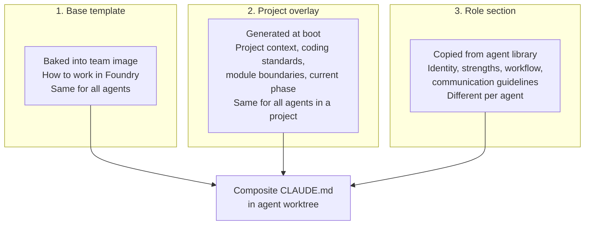

---
tags:
  - type/resource
  - domain/tech
  - project/foundry
created: 2026-03-23
status: growing
---

# Dev agent architecture

Design for how dev agents (backend, frontend, QA, etc.) receive tasks, work, communicate, and signal completion inside the team container. Includes the composite CLAUDE.md structure, completion protocol, inter-agent messaging, and PO directive formats.

Related: [[Design Specification]], [[PO Prompt Architecture]], [[Implementation Plan]]

## Core principles

1. **Moderate autonomy.** Agents get enough context to make good local decisions (task description, relevant spec section, shared artifacts). They defer to the PO for anything that crosses module boundaries or changes scope.
2. **Task via prompt.** The agent receives its task as the `-p` argument when launched. No task files to read. Simple, direct.
3. **Self-verification.** Agents verify their own work against a risk-based completion checklist before signaling done. Catches obvious issues without burning PO tokens.
4. **Direct peer messaging.** Agents can message each other for task-related questions. The PO receives copies and can intervene. Like a real team — people talk directly, the lead watches.
5. **Files are the protocol.** Completion signals, messages, and artifacts are JSON files on the shared volume. The sidecar watches for changes and publishes to RabbitMQ. Simple, debuggable, no custom IPC.

## Composite CLAUDE.md

Each agent's CLAUDE.md is assembled from three parts by the workspace builder at container boot:



The agent also gets in its worktree:
- `.claude/languages/<stack>.md` — language conventions, selected based on role
- `.claude/frameworks/<framework>.md` — framework patterns, selected based on role
- `.claude/agent-role.md` — full role definition from the agent library

### Base template

Baked into the team container image at `/foundry/workspace-template/CLAUDE.md`. Every agent gets this as the foundation. Covers Foundry-specific operating procedures, not coding standards.

```markdown
# Foundry Agent

You are a development agent working inside a Foundry team container.
You've been assigned a task by the Product Owner. Your job is to
implement it, verify your work, and signal completion.

## How you work

- You work in a git worktree on your own branch. Other agents have
  their own worktrees on separate branches. You cannot see their
  work directly.
- Your task was provided in the prompt that launched this session.
  That prompt contains everything you need: task title, description,
  risk level, and relevant context.
- The shared volume at /shared/ contains artifacts other agents and
  the PO have produced — API contracts, designs, review notes. Read
  what's relevant to your task.
- When you finish, follow the completion checklist for your task's
  risk level.

## Shared volume

/shared/
├── spec.md              ← the execution spec (read for context)
├── contracts/           ← API contracts, OpenAPI specs
├── designs/             ← UI/UX design artifacts
├── context/             ← agent context summaries
├── reviews/             ← PO code review notes
├── messages/            ← inter-agent messages
└── status/              ← completion signals

Read from /shared/ as needed for context. Write artifacts your
task produces (API contracts, design docs) to the appropriate
subdirectory.

## Completion checklist

Before signaling done, verify your work based on the task's risk level:

**Low risk (CRUD, boilerplate, config):**
- [ ] Code compiles / builds without errors
- [ ] Tests pass
- [ ] Linter clean
- [ ] Changes committed to your branch

**Medium risk (new features, integrations, API changes):**
- [ ] All of the above
- [ ] Implementation matches the task description
- [ ] Edge cases handled
- [ ] Tests cover core behavior (not just happy path)
- [ ] Any new API contracts written to /shared/contracts/

**High risk (auth, payments, migrations, security):**
- [ ] All of the above
- [ ] Security implications considered
- [ ] Error handling covers failure modes
- [ ] Test coverage is comprehensive
- [ ] No secrets or credentials in code
- [ ] Changes documented in a review note at /shared/reviews/<task_id>.md

## Signaling completion

When the checklist passes, write a completion file:

/shared/status/<agent_id>.json:
{
  "status": "done",
  "task_id": "<your task id>",
  "branch": "<your branch>",
  "summary": "<one paragraph of what you did>",
  "artifacts": ["<list of files you wrote to /shared/>"],
  "tests_passed": true,
  "commits": <number of commits>
}

Then notify the sidecar:
```bash
curl -s -X POST http://localhost:3000/notify \
  -H 'Content-Type: application/json' \
  -d '{"path": "/shared/status/<agent_id>.json", "type": "status", "agent_id": "<agent_id>"}'
```

Then stop working. The process will exit naturally.

If you cannot complete the task, write:
{
  "status": "blocked",
  "task_id": "<your task id>",
  "reason": "<what's blocking you>",
  "attempted": "<what you tried>"
}

And notify the sidecar the same way.

## Messaging other agents

You can message other agents for task-related questions. Write to:

/shared/messages/<to_agent_id>/<timestamp>.json:
{
  "id": "<unique message id>",
  "from": "<your agent id>",
  "to": "<target agent id>",
  "subject": "<brief topic>",
  "body": "<your question or information>",
  "task_id": "<your task id>"
}

After writing a message, notify the sidecar:
```bash
curl -s -X POST http://localhost:3000/notify \
  -H 'Content-Type: application/json' \
  -d '{"path": "/shared/messages/<to_agent_id>/<timestamp>.json", "type": "message", "agent_id": "<your_agent_id>"}'
```

Check /shared/messages/<your_agent_id>/ for messages addressed to you.
The PO receives copies of all messages and may intervene.

Keep messages focused on your task. Don't coordinate architecture
or scope changes — that's the PO's job.

## Pause signals

Periodically check for /foundry/state/pause-signal. If it exists:
1. Finish your current subtask (don't stop mid-edit)
2. Commit all work
3. Write a context summary to /shared/context/<agent_id>.md
   describing: what you were doing, what's done, what's left,
   any important context for whoever picks this up
4. Write a paused status to /shared/status/<agent_id>.json
5. Exit cleanly

## What you don't do

- Don't modify files outside your worktree
- Don't push to remote (the control plane handles that)
- Don't change branches
- Don't read other agents' worktrees directly — use /shared/
- Don't make architecture decisions that affect other agents'
  work — raise it as a message and let the PO decide
```

### Project overlay

Generated by the workspace builder at container boot. Appended after the base template. Contains project-specific context shared across all agents in the team.

```markdown
## Project context

**Project:** {project_name}
**Repo:** {repo_url}
**Description:** {description}

### Module boundaries

Do not modify code outside your assigned module unless your task
explicitly requires it. The modules are:

{list of modules from the spec, generated by workspace builder}

### Coding standards

{extracted from the spec and language/framework conventions}

### Current phase

{current phase from plan.md, with summary of what's done and what's in progress}

### Relevant spec sections

{the workspace builder extracts and inserts the section of the
execution spec relevant to this agent's current task — not the
full spec, just what matters}
```

The project overlay is regenerated when:
- The team container boots
- The PO updates the execution spec (the sidecar triggers a workspace refresh)
- A new phase begins

### Role section

Copied from the agent library. This is the agent's identity. Appended last in the composite CLAUDE.md.

```markdown
## Your role

You are a **{role_name}**. See .claude/agent-role.md for your
full role definition, workflow, and communication guidelines.
```

The full role definition lives in `.claude/agent-role.md` in the agent's worktree, loaded by Claude Code's native `.claude/` directory support.

## Agent role definition format

Each role is a markdown file with YAML frontmatter in the agent library directory:

```yaml
---
name: backend-developer
description: "Implements server-side logic, APIs, database queries, and business rules"
provider: claude
tools: Read, Write, Edit, Bash, Glob, Grep
model: sonnet
min_model: haiku
---

# Backend developer

You implement server-side code: API endpoints, database queries,
business logic, and service layers.

## Your strengths

- API design and REST conventions
- Database schema and query optimization (sqlx, hand-written SQL)
- Error handling and input validation
- Authentication and authorization flows
- Testing: unit tests, integration tests, table-driven patterns

## How you approach a task

1. Read the task description and relevant API contracts in /shared/contracts/
2. Understand the data model — check existing migrations and schema
3. Write a failing test first for the core behavior
4. Implement the minimum code to pass the test
5. Add edge case tests
6. Run the full test suite for your module
7. Run the linter
8. Commit with a descriptive message

## When to message other agents

- Frontend agent: when you've published a new API contract to /shared/contracts/
- Frontend agent: when an endpoint's request/response shape changes
- UI/UX agent: when you need clarification on a user flow that affects the API

## When to escalate to the PO

- The task requires changes to another module's code
- You discover the spec is ambiguous or contradictory
- A dependency doesn't work as documented
- You think the task's risk level should be higher
```

Every role follows the same structure:
1. **Identity** — one sentence, what this role does
2. **Strengths** — what the agent is an expert at (frames its self-image)
3. **Workflow** — step-by-step approach to a task
4. **When to message peers** — specific triggers for inter-agent communication
5. **When to escalate** — specific triggers for raising issues to the PO

## Communication protocol

### Completion signals

Agents write to `/shared/status/<agent_id>.json`. The sidecar watches this directory and publishes to RabbitMQ.

**Success:**

```json
{
  "status": "done",
  "task_id": "task-042",
  "agent_id": "backend-dev-1",
  "branch": "feat/user-registration",
  "summary": "Implemented POST /api/users endpoint with email validation, password hashing, and JWT token generation. Added table-driven tests covering registration, duplicate email, and invalid input cases.",
  "artifacts": [
    "/shared/contracts/users-api.yaml"
  ],
  "tests_passed": true,
  "commits": 3,
  "timestamp": "2026-03-23T14:30:00Z"
}
```

**Blocked:**

```json
{
  "status": "blocked",
  "task_id": "task-042",
  "agent_id": "backend-dev-1",
  "reason": "The spec says to integrate with Stripe but no Stripe API key is configured and the payment module doesn't exist yet.",
  "attempted": "Tried to scaffold the payment handler but realized this depends on task-038 which isn't complete.",
  "timestamp": "2026-03-23T14:30:00Z"
}
```

**Paused (written on clean pause):**

```json
{
  "status": "paused",
  "task_id": "task-042",
  "agent_id": "backend-dev-1",
  "context_summary": "/shared/context/backend-dev-1.md",
  "branch": "feat/user-registration",
  "commits": 2,
  "timestamp": "2026-03-23T14:30:00Z"
}
```

The sidecar translates these into RabbitMQ events on the `foundry.events` exchange. The Go control plane subscribes and updates Postgres.

### Inter-agent messages

Agents write to `/shared/messages/<to_agent_id>/`. The sidecar watches for new files, delivers a notification to the target agent, and publishes a copy to RabbitMQ so the PO receives it.

```json
{
  "id": "msg-001",
  "from": "backend-dev-1",
  "to": "frontend-dev-1",
  "subject": "Users API contract ready",
  "body": "Published the users API contract to /shared/contracts/users-api.yaml. Endpoints: POST /api/users (register), POST /api/auth/login, GET /api/users/me. All return JSON with the standard error format from the spec.",
  "task_id": "task-042",
  "artifacts": ["/shared/contracts/users-api.yaml"],
  "timestamp": "2026-03-23T14:32:00Z"
}
```

The receiving agent checks `/shared/messages/<own_id>/` on startup and periodically during work. The sidecar also writes a `new-messages` flag file in the agent's worktree to trigger attention.

**PO intervention** — if the PO disagrees with a message, it writes a follow-up:

```json
{
  "id": "msg-002",
  "from": "po",
  "to": "frontend-dev-1",
  "subject": "RE: Users API contract ready",
  "body": "Hold off on integrating the login endpoint. I'm reviewing the auth approach and may change the token format. Start with the registration flow only.",
  "in_reply_to": "msg-001",
  "timestamp": "2026-03-23T14:35:00Z"
}
```

### PO directives

#### Task assignment

Delivered as the `-p` prompt when launching the agent process:

```
[foundry:task]
task_id: task-042
title: Implement user registration endpoint
description: |
  Create POST /api/users endpoint. Accept email and password.
  Validate email format, enforce minimum password length (8 chars).
  Hash password with bcrypt. Return JWT token on success.
  Return 409 on duplicate email.
risk_level: medium
branch: feat/user-registration
agent_id: backend-dev-1
agent_role: backend-developer

[context]
Relevant spec section:
  The users module handles registration, authentication, and profile
  management. All endpoints require JSON request/response. Use the
  standard error format: {"error": {"code": "...", "message": "..."}}.

Related artifacts:
  - /shared/contracts/auth-flow.md (written by PO during planning)

Dependencies completed:
  - task-038: Database migrations for users table (done)
  - task-039: Shared error response helpers (done)
```

#### Revision directive

When the PO reviews work and wants changes, the control plane launches a new agent session:

```
[foundry:revision]
task_id: task-042
title: Implement user registration endpoint (revision)
agent_id: backend-dev-1
agent_role: backend-developer
branch: feat/user-registration
review: /shared/reviews/task-042.md

Read the review at the path above. Fix the issues listed.
Your previous work is on the branch — pick up where you left off.
```

#### Review feedback file

Written by the PO to `/shared/reviews/<task_id>.md`:

```markdown
# Review: task-042 — Implement user registration endpoint

**Verdict:** needs changes
**Risk level:** medium

## Issues

1. **Missing rate limiting** — The registration endpoint has no rate
   limiting. The spec mentions rate limiting in the security section.
   Add a basic IP-based rate limiter (10 requests/minute).

2. **Password validation** — You enforce minimum length but the spec
   also requires at least one uppercase letter and one number.

## What looks good

- Error handling is solid, context wrapping is consistent
- Test coverage is thorough for the happy path
- API contract matches the spec

## Action

Fix the two issues above and update your completion signal. I'll
re-review after.
```

### RabbitMQ event schema

The sidecar publishes events to the `foundry.events` topic exchange. Routing key: `events.<project_id>.<event_type>`. The Go control plane subscribes to `events.<project_id>.*`.

```json
{
  "event_type": "task_completed",
  "project_id": "proj-001",
  "task_id": "task-042",
  "agent_id": "backend-dev-1",
  "payload": {
    "branch": "feat/user-registration",
    "summary": "Implemented user registration endpoint...",
    "commits": 3,
    "tests_passed": true
  },
  "timestamp": "2026-03-23T14:30:00Z"
}
```

### Event types

| Event type | Published by | Consumed by |
|-----------|-------------|-------------|
| `task_completed` | Sidecar (from status file) | Control plane → triggers PO review session |
| `task_blocked` | Sidecar (from status file) | Control plane → triggers PO escalation session |
| `agent_paused` | Sidecar (from status file) | Control plane → updates DB |
| `agent_message` | Sidecar (from messages dir) | Control plane → PO (copy), target agent sidecar |
| `agent_started` | Sidecar (on process launch) | Control plane → updates DB, UI |
| `agent_crashed` | Supervisor (unexpected exit) | Control plane → triggers PO escalation |
| `heartbeat` | Sidecar (every 10s) | Control plane → health monitor |
| `artifact_produced` | Sidecar (file watch on /shared/) | Control plane → event log |
| `po_intervention` | PO session | Control plane → target agent sidecar |
| `budget_threshold` | Control plane (budget tracker) | PO session |

### Sidecar responsibilities

The sidecar (`sidecar.js`) is the bridge between the file-based protocol inside the container and the RabbitMQ-based protocol outside.

#### Notification mechanism

The sidecar exposes an HTTP endpoint for explicit write notifications. This replaces filesystem watching (`inotify`), which doesn't work reliably on Docker bind-mounted volumes — especially on macOS Docker Desktop where the VM boundary prevents host-side write events from propagating into the container.

**Primary: HTTP notification endpoint.** The sidecar runs a lightweight HTTP server (e.g., port 3000 inside the container). After writing a file to `/shared/`, the writer POSTs to the sidecar:

```
POST /notify
{
  "path": "/shared/status/backend-dev-1.json",
  "type": "status",
  "agent_id": "backend-dev-1"
}
```

- Agent processes inside the container call `http://localhost:3000/notify`
- The PO agent on the host calls `http://localhost:<mapped-port>/notify` (port mapped in Docker)
- The control plane can also call the endpoint for PO-written artifacts

**Safety net: Slow poll.** The sidecar runs a chokidar poll every 10 seconds (`usePolling: true, interval: 10000`) as a fallback to catch any writes where the notification was missed (writer crash between file write and HTTP POST). This is not the primary detection mechanism — it's insurance.

The agent's CLAUDE.md includes instructions to call the notification endpoint after writing to `/shared/`. This is a simple `curl` or `fetch` call appended to each write operation.

#### Core responsibilities

1. **Receive notifications** — HTTP endpoint processes write notifications, parses the JSON file at the reported path, publishes the appropriate event to RabbitMQ
2. **Poll as fallback** — slow chokidar poll catches missed notifications
3. **Subscribe to `foundry.commands.<project_id>`** — receive commands from the control plane (pause, assign task, etc.), translate to file signals or supervisor commands
4. **Deliver messages** — route PO interventions and cross-agent messages to the appropriate `/shared/messages/<agent_id>/` directory, write `new-messages` flag to target agent's worktree
5. **Stream agent stdout** — capture stdout from each agent process (via supervisor), publish to `foundry.logs` exchange with routing key `logs.<project_id>.<agent_id>`
6. **Heartbeat** — publish heartbeat events every 10 seconds with container health metrics

### Message delivery guarantees

- **At-least-once** for completion signals and messages. The sidecar publishes to RabbitMQ with publisher confirms. If the publish fails, it retries.
- **Best-effort** for log streaming and heartbeats. Dropped log lines or missed heartbeats are acceptable.
- **Ordering** within a single agent's events is guaranteed (the sidecar processes one agent's events sequentially). Cross-agent ordering is not guaranteed and shouldn't be relied upon.

## Agent launch sequence

The full sequence from task assignment to agent running:

1. Control plane receives an unblocked task from the DAG resolver
2. Control plane resolves model tier: `task.risk_level` → `risk_profile.model_routing` → tier → `provider.ModelFor(tier)`
3. Control plane builds the task prompt (structured `[foundry:task]` block)
4. Control plane sends `launch_agent` command to the team container's sidecar via RabbitMQ
5. Sidecar receives the command, passes it to the supervisor
6. Supervisor creates a git worktree (if not already exists for this agent)
7. Supervisor launches Claude Code in the worktree:

```bash
claude --bare \
  -p "<task prompt>" \
  --output-format stream-json \
  --model <resolved_model> \
  --max-budget-usd <task_budget> \
  --max-turns <task_max_turns> \
  --dangerously-skip-permissions \
  --allowedTools "Read,Write,Edit,Bash,Glob,Grep" \
  --no-session-persistence
```

8. Supervisor captures the process PID, registers it in `/foundry/state/agents.json`
9. Sidecar publishes `agent_started` event
10. Agent works, writes artifacts to `/shared/`, messages peers as needed
11. Agent completes checklist, writes status to `/shared/status/<agent_id>.json`
12. Sidecar detects completion, publishes `task_completed` event
13. Control plane receives event, triggers PO review session
14. PO reviews. If approved: control plane marks task done, DAG resolver checks for newly unblocked tasks. If revision needed: control plane launches new agent session with revision prompt.
