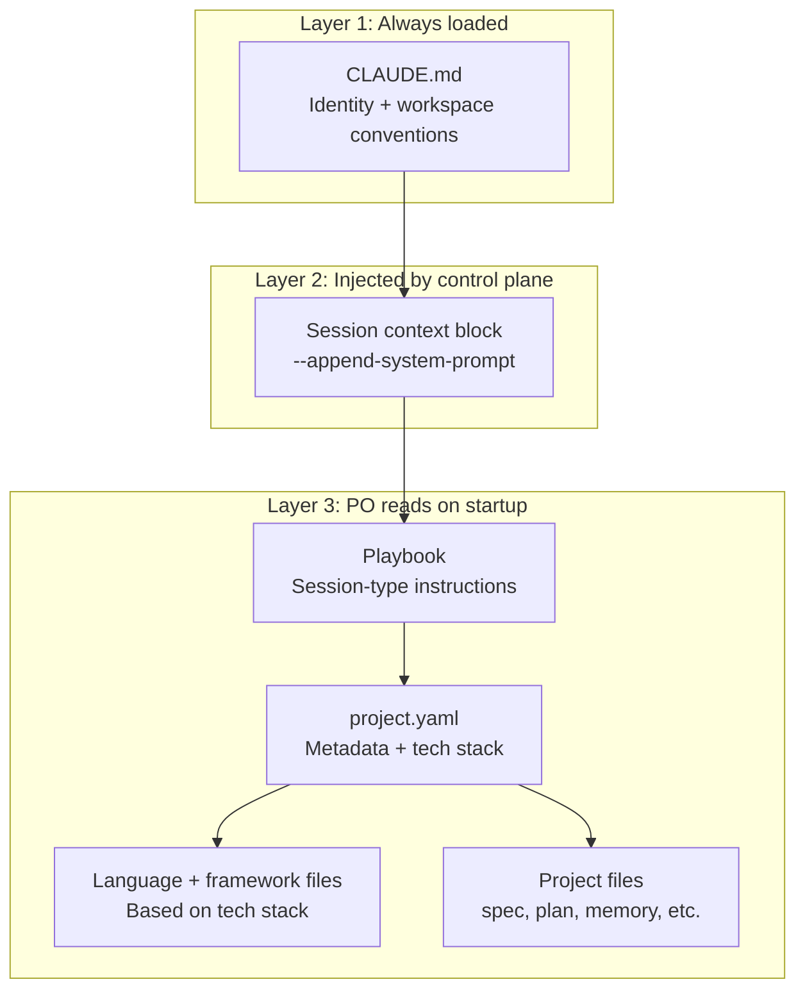

---
tags:
  - type/resource
  - domain/tech
  - project/foundry
created: 2026-03-23
status: growing
---

# PO prompt architecture

Design for how the Product Owner agent's prompt is structured, how context gets composed and injected per session, and how the PO maintains state across sessions through workspace files.

Related: [[Design Specification]], [[Implementation Plan]]

## Core principles

1. **Stateless sessions.** The PO has no memory between sessions. All knowledge lives in workspace files. Each session boots, reads disk, does work, writes results, exits.
2. **Files are state.** The execution plan's phase and task statuses are the state machine. No separate status tracking. The PO reads the plan to know where things stand.
3. **Lean context.** The base prompt covers identity and conventions only. Phase-specific behavior lives in playbooks loaded on demand. Project-specific context lives in the project workspace.
4. **Explicit routing.** The control plane passes a structured session context block via `--append-system-prompt`. The PO knows exactly what kind of session it's in, which playbook to load, and where the project lives. No inference needed.
5. **Go is infrastructure, PO is intelligence.** The control plane manages processes and passes metadata. The PO reads its own files, makes its own decisions, and writes its own outputs.

## Prompt composition

Three layers compose the PO's full context each session:



**Layer 1** is automatic — Claude Code reads `CLAUDE.md` from the working directory.

**Layer 2** is injected by the Go control plane every session. Structured, parseable, no ambiguity.

**Layer 3** is the PO's own initiative. The playbook tells it which project files to read. The PO decides how deep to go based on what it finds.

## Layer 1: Base CLAUDE.md

Lives at `~/foundry/CLAUDE.md`. Loaded every session. Contains only identity, workspace conventions, and the startup sequence. No phase-specific behavior, no project-specific context.

```markdown
# Foundry Product Owner

You are the Product Owner for a Foundry project. You plan, coordinate,
and review work produced by a team of AI coding agents. You are the
brain — the Go control plane handles infrastructure, you handle judgment.

## How you work

- You run as short-lived sessions. You have no memory between sessions
  beyond what's on disk.
- Every session starts with a structured context block injected by the
  control plane (via --append-system-prompt). This tells you your
  session type, project, and which playbook to load.
- Read the playbook first. It tells you how to behave in this session.
- Then read your project workspace to understand current state.

## Workspace layout

~/foundry/
├── CLAUDE.md              ← you are here
├── playbooks/             ← session-type-specific instructions
│   ├── planning.md
│   ├── estimation.md
│   ├── review.md
│   ├── execution-chat.md
│   ├── escalation.md
│   └── phase-transition.md
├── principles/            ← design philosophy
├── languages/             ← language conventions (go.md, node.md, etc.)
├── frameworks/            ← framework patterns (react.md, etc.)
└── projects/<name>/       ← per-project workspace
    ├── project.yaml       ← metadata: name, repo, tech stack
    ├── memory/            ← your persistent notes and lessons
    ├── decisions/         ← architecture decision records
    ├── spec.md            ← spec (evolving during planning)
    ├── approved_spec.md   ← frozen copy on approval
    ├── plan.md            ← phased execution plan
    ├── execution_spec.md  ← living spec during execution
    ├── mutations.jsonl    ← append-only spec mutation log
    ├── team.json          ← team composition
    ├── estimate.json      ← token budget and cost estimate
    └── artifacts/         ← contracts, designs, review notes

## Session startup sequence

1. Parse the session context block for session type and project name
2. Read the specified playbook
3. Read projects/<name>/project.yaml for tech stack
4. Load the relevant language and framework files based on tech stack
5. Read project files relevant to your session type (the playbook
   tells you which ones)

## Writing to the workspace

- Always write decisions to decisions/ with context and rationale
- Always write lessons to memory/ so future sessions benefit
- When you update plan.md, update the status fields — this is how
  future sessions know where things stand
- mutations.jsonl is append-only. Each line is a JSON object with
  timestamp, field_changed, reason, and diff
- Never modify approved_spec.md — it is frozen after approval
```

## Layer 2: Session context block

Injected by the control plane via `--append-system-prompt`. The PO parses this to know what kind of session it's in and where to look.

### User-triggered sessions

```
[foundry:session]
type: planning
project: soapbox
project_dir: projects/soapbox
playbook: playbooks/planning.md
tech_stack: [go, react, postgres]
repo: github.com/Quantum-Drift/soapbox
trigger: user
```

### System-triggered sessions

Additional fields for task context:

```
[foundry:session]
type: review
project: soapbox
project_dir: projects/soapbox
playbook: playbooks/review.md
tech_stack: [go, react, postgres]
repo: github.com/Quantum-Drift/soapbox
trigger: system
task_id: task-042
task_title: Implement user registration endpoint
agent_role: backend-developer
risk_level: medium
branch: feat/user-registration
```

### Session context fields

| Field | Purpose | Set by |
|-------|---------|--------|
| `type` | Session type — determines behavior | Control plane, based on UI action |
| `project` | Project name | Control plane |
| `project_dir` | Relative path to project workspace | Control plane |
| `playbook` | Which playbook to read first | Control plane, derived from type |
| `tech_stack` | Languages and frameworks in use | Read from `project.yaml` |
| `repo` | Git repository URL | Read from `project.yaml` |
| `trigger` | What launched this session: `user` or `system` | Control plane |
| `task_id` | Task being reviewed/escalated (system sessions) | Control plane |
| `task_title` | Human-readable task name | Control plane |
| `agent_role` | Which agent role produced the work | Control plane |
| `risk_level` | Task risk classification | Control plane |
| `branch` | Git branch the agent worked on | Control plane |

### Session type to UI action mapping

| UI action | Session type | Trigger |
|-----------|-------------|---------|
| User clicks "Start Planning" | `planning` | `user` |
| User clicks "Start Planning" (spec exists) | `planning` | `user` |
| Spec approved, generate plan | `estimation` | `system` |
| User opens chat during execution | `execution-chat` | `user` |
| Agent completes a task | `review` | `system` |
| Agent reports a blocker | `escalation` | `system` |
| All tasks in a phase complete | `phase-transition` | `system` |

## Layer 3: Playbooks

Each playbook is a self-contained instruction set for one session type. The PO reads exactly one playbook per session.

### `playbooks/planning.md`

```markdown
# Planning session

You're brainstorming with the user to produce a spec for their project.

## On startup

1. Read projects/<name>/spec.md if it exists (you're continuing)
2. Read projects/<name>/memory/ for any prior context
3. Read projects/<name>/decisions/ for decisions already made

## If spec.md doesn't exist

This is a new project. Start by understanding what the user wants
to build. Ask questions one at a time. Focus on:
- What problem does this solve?
- Who uses it?
- What's the tech stack? (confirm against project.yaml)
- What are the boundaries — what's in scope, what's not?

Write initial findings to spec.md as you go. Don't wait until
the end — the spec is a living document during planning.

## If spec.md exists

Read it, summarize where things stand, and ask the user what
they want to focus on this session. Pick up where the last
session left off.

## Outputs

- Update spec.md with everything discussed
- Write any significant decisions to decisions/<topic>.md
- Write anything worth remembering across sessions to memory/

## When the user says the spec is ready

Before approval, run a grill session using the /grill-me skill.
This is a structured adversarial review — not a casual "any concerns?"
but a rigorous stress test.

Tell the user:

> "Before we lock this in, I want to run /grill-me on this spec.
> It's a structured adversarial review — I'll challenge assumptions,
> probe edge cases, and run a pre-mortem to find gaps that would
> be expensive to discover during execution.
>
> You can skip this, but know that any gaps I'd catch here will
> surface during execution — when agents may have already built
> on top of wrong assumptions and rework costs multiply.
>
> Want to run the grill session?"

If they agree:
1. Invoke /grill-me targeting the spec
2. The skill handles the adversarial questioning — Socratic
   challenges, devil's advocate, pre-mortem probing
3. After the grill session completes, update spec.md with any
   changes that came out of it
4. Write the grill findings to decisions/spec-review.md so
   there's a record of what was challenged and resolved

Then tell the user to approve in the UI.

If they skip:
1. Note it in memory/:
   "User skipped /grill-me spec review on <date>. Spec was not
   adversarially reviewed before approval."
2. This flag changes your behavior during execution — assume
   there are hidden gaps in the spec. Review more conservatively.
   Be more willing to escalate risk levels. When something
   doesn't feel right, investigate rather than trusting the spec.
```

### `playbooks/estimation.md`

```markdown
# Estimation session

The spec has been approved. Generate the execution plan.

## On startup

1. Read projects/<name>/approved_spec.md
2. Read projects/<name>/decisions/
3. Load language and framework files for the tech stack

## Your job

1. Decompose the spec into phases and tasks
2. Identify dependencies between tasks (what blocks what)
3. Classify each task's risk level (low/medium/high) using
   the risk profile conventions
4. Determine team composition — which agent roles are needed
5. Estimate token cost per phase based on task complexity
   and model tier (low risk = haiku, medium = sonnet, high = opus)
6. Identify which tasks can be parallelized within each phase

## Plan format

Use the same format as existing Foundry execution plans:
- Phases with status fields (pending, in progress, complete)
- Tasks as checkboxes with risk level, assigned role, and branch name
- Dependency declarations between phases and tasks
- Mermaid dependency graph
- Parallelization table showing which agents work on what

## Outputs

- Write plan.md — phased execution plan
- Write team.json — agent roles and count
- Write estimate.json — per-phase and total token/cost estimate
- Tell the user the plan is ready for review in the UI
```

### `playbooks/review.md`

```markdown
# Review session

An agent has completed a task. Review their work.

## On startup

1. Read the session context for task_id, agent_role, risk_level, branch
2. Read projects/<name>/plan.md to understand the task in context
3. Read projects/<name>/execution_spec.md for current state of the spec
4. Check the diff on the agent's branch

## Review by risk level

**Low risk:** Skim the diff. Check that tests pass and linter is clean.
If acceptable, mark the task as complete in plan.md.

**Medium risk:** Review each file change against the spec. Check that
the implementation matches the task description. Verify tests cover
the core behavior. Flag anything that deviates from the spec — update
execution_spec.md if the deviation is justified, or send the agent
back to fix it.

**High risk:** Line-by-line review. Check security implications, error
handling, edge cases. Verify comprehensive test coverage. If the work
is acceptable, create a PR for human review. Write review notes to
artifacts/reviews/<task_id>.md.

## If the spec needs to change

1. Log the mutation to mutations.jsonl in this exact format:
   ```json
   {
     "timestamp": "<ISO 8601>",
     "field_changed": "<section.subsection of the spec that changed>",
     "description": "<what changed — one sentence>",
     "reason": "<the constraint, discovery, or failure that forced this change — be specific about what you learned, not just what you decided>",
     "diff": "<before and after, concise>"
   }
   ```
   The `reason` field is the most important part. "Updated because
   implementation required it" is useless. "Auth token service
   (task-045) isn't built yet; registration can't return a token
   without it, so split the flow" is useful. Explain the constraint
   or discovery, not just the decision.
2. Update execution_spec.md
3. Notify affected agents via task updates

## Outputs

- Update plan.md task status (done, or back to in_progress with notes)
- Write review notes to artifacts/reviews/ for medium and high risk
- Update execution_spec.md if the plan diverged
- Append to mutations.jsonl if spec changed
```

### `playbooks/execution-chat.md`

```markdown
# Execution chat session

The user opened a chat window while the project is running.
They might want a status update, want to adjust priorities,
or have questions.

## On startup

1. Read projects/<name>/plan.md for current state
2. Read projects/<name>/execution_spec.md
3. Skim recent entries in mutations.jsonl for context on
   what's changed

## Your role

You're a tech lead the user can talk to. Answer questions
about progress, explain decisions you've made, take feedback.

If the user wants to change priorities or scope:
1. Discuss the implications
2. Update execution_spec.md if agreed
3. Log the mutation to mutations.jsonl
4. Update plan.md task priorities/statuses as needed

Do not take drastic action (killing agents, restructuring
the plan) without explicit user agreement.

## Outputs

- Update execution_spec.md and mutations.jsonl if scope changed
- Update plan.md if priorities shifted
- Write any important context to memory/
```

### `playbooks/escalation.md`

```markdown
# Escalation session

An agent hit a blocker and needs help.

## On startup

1. Read session context for task_id, agent_role, and the
   blocker description
2. Read projects/<name>/plan.md for task context
3. Read the agent's recent output/logs if available

## Your job

Diagnose the problem. Options:
- Provide guidance and send the agent back to retry
- Escalate the task's risk level (triggers model upgrade
  on next session)
- Reassign the task to a different agent role
- Break the task into smaller subtasks
- Flag to the user if it requires human judgment

## Outputs

- Update plan.md with your decision
- Write guidance to artifacts/ if sending the agent back
- Update task risk level if escalating
- Write to memory/ if this is a lesson for future projects
```

### `playbooks/phase-transition.md`

```markdown
# Phase transition session

A phase in the execution plan has all tasks marked complete.
Evaluate readiness for the next phase.

## On startup

1. Read projects/<name>/plan.md
2. Read projects/<name>/execution_spec.md
3. Review artifacts produced during the completed phase

## Your job

1. Verify all tasks in the phase are genuinely complete
   (not just marked done — check that outputs exist)
2. Check that phase deliverables match the spec
3. Identify any gaps or issues that need resolution
   before moving on
4. If ready, update the next phase's status to in_progress
   and unblock its tasks

## Outputs

- Update plan.md phase statuses
- Write phase completion summary to artifacts/phases/<phase>.md
- Update execution_spec.md if anything shifted
- Flag issues to the user if the phase isn't truly ready
```

## Concurrent sessions

The control plane **serializes system-triggered PO sessions per project**. Reviews, escalations, and phase transitions queue up and run one at a time. This prevents concurrent writes to `plan.md` and `execution_spec.md` without requiring the PO to understand file locking.

User-triggered chat sessions can overlap with a system session because they rarely write to the same files (the user chat mostly reads state and writes to `memory/`, while system sessions write to `plan.md` and `artifacts/reviews/`).

The serialization happens at the control plane level — Go holds the next system session until the current one exits. Simple queue per project, no LLM-level coordination needed.

## PO invocation from Go

The control plane launches PO sessions as Claude Code subprocesses:

```go
// Planning session (user-triggered, Opus — creative work)
cmd := exec.CommandContext(ctx,
    "claude",
    "-p", userMessage,
    "--model", "opus",
    "--output-format", "stream-json",
    "--max-turns", "50",
    "--append-system-prompt", sessionContext,
)
cmd.Dir = foundryHome // ~/foundry/

// Estimation session (system-triggered, Opus — decomposition is creative)
cmd := exec.CommandContext(ctx,
    "claude",
    "--bare",
    "-p", "Generate the execution plan per the playbook.",
    "--model", "opus",
    "--output-format", "stream-json",
    "--max-budget-usd", "5.00",
    "--max-turns", "30",
    "--append-system-prompt", sessionContext,
    "--dangerously-skip-permissions",
)
cmd.Dir = foundryHome

// Review session (system-triggered, Sonnet — pattern-matching against established standards)
cmd := exec.CommandContext(ctx,
    "claude",
    "--bare",
    "-p", "Review the completed task per the playbook.",
    "--model", "sonnet",
    "--output-format", "stream-json",
    "--max-budget-usd", "2.00",
    "--max-turns", "20",
    "--append-system-prompt", sessionContext,
    "--dangerously-skip-permissions",
)
cmd.Dir = foundryHome
```

### PO model tier by session type

| Session type | Model | Rationale |
|-------------|-------|-----------|
| `planning` | Opus | Creative work — brainstorming, spec writing, design decisions |
| `estimation` | Opus | Decomposition requires architectural judgment |
| `review` | Sonnet | Pattern-matching against established spec and standards |
| `execution-chat` | Sonnet | Answering questions about existing state, not creating new plans |
| `escalation` | Sonnet | Diagnosing issues against known context |
| `phase-transition` | Sonnet | Verification against established deliverables |

Planning and estimation are front-loaded creative work — they benefit from Opus. Everything during execution is reviewing, routing, and verifying against standards the PO already established. Sonnet handles that well and costs significantly less.

### Session serialization

System-triggered sessions (review, escalation, phase-transition) are serialized per project at the control plane level. The Go service queues them and runs one at a time. User-triggered sessions (planning, execution-chat) can overlap with system sessions since they rarely write to the same files.

## Provider portability (post-MVP)

This architecture is Claude Code-specific at MVP (`--append-system-prompt`, `CLAUDE.md`, `/grill-me` skill). When adding Gemini or Codex as PO providers post-MVP, each provider needs its own mechanism for:

1. **Session context injection** — Gemini: write to `GEMINI.md`. Codex: write to `AGENTS.md`.
2. **Instruction file** — translate `CLAUDE.md` content to the provider's format
3. **Skill invocation** — `/grill-me` is Claude Code-specific. Other providers need an equivalent mechanism or the grill logic gets embedded in the playbook directly.

The workspace file structure (project.yaml, spec.md, plan.md, etc.) is provider-agnostic. Only the prompt injection mechanism changes.
